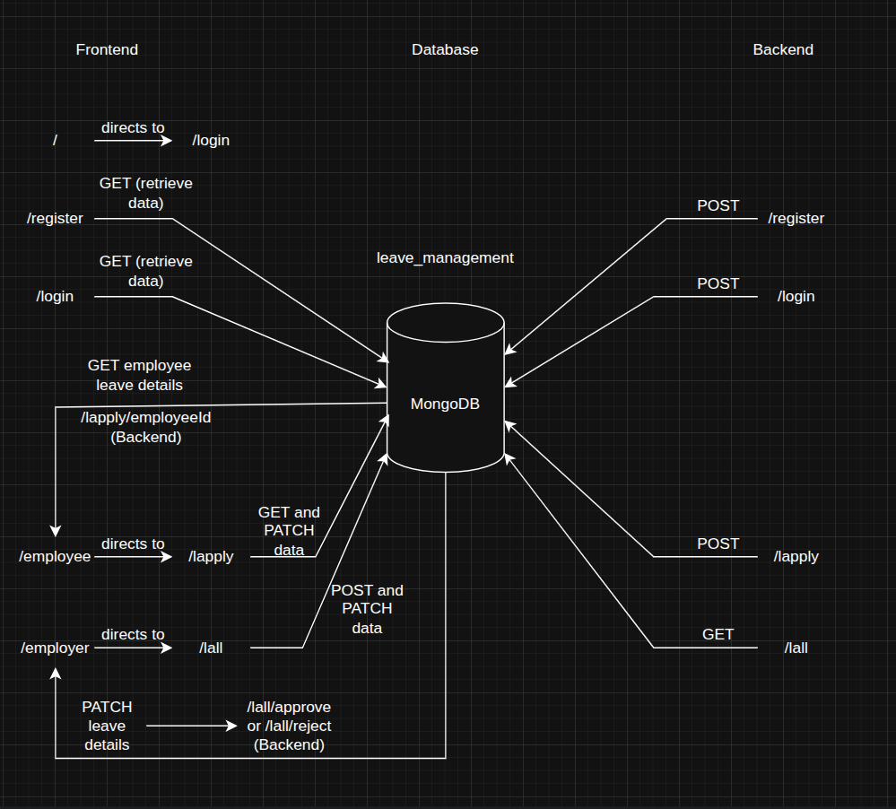
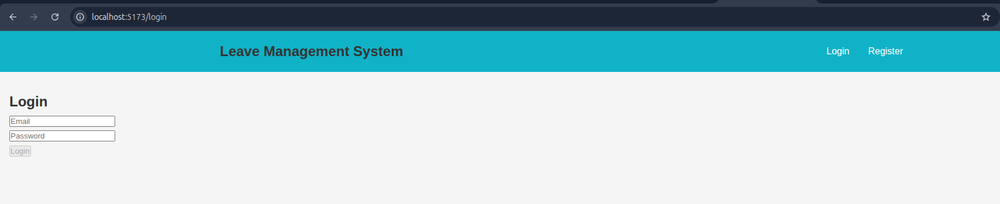
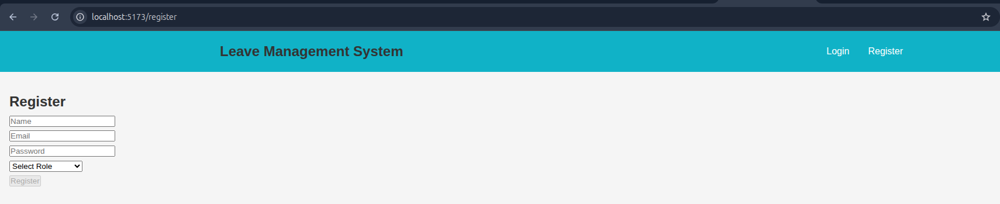
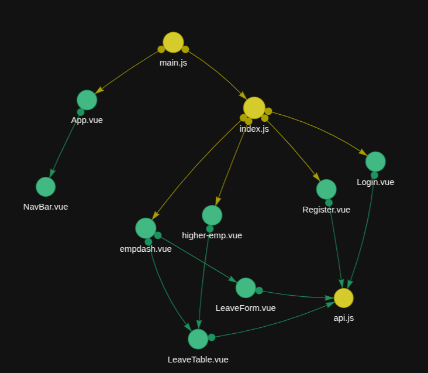
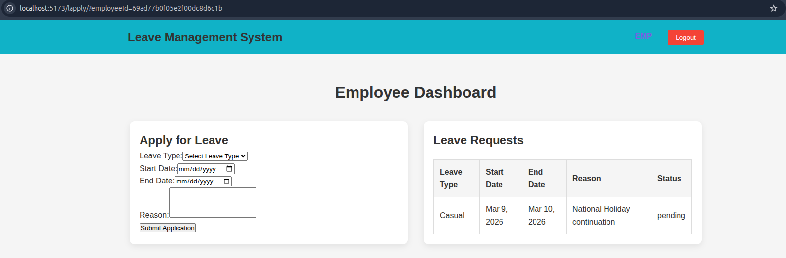
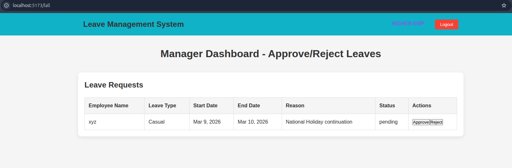
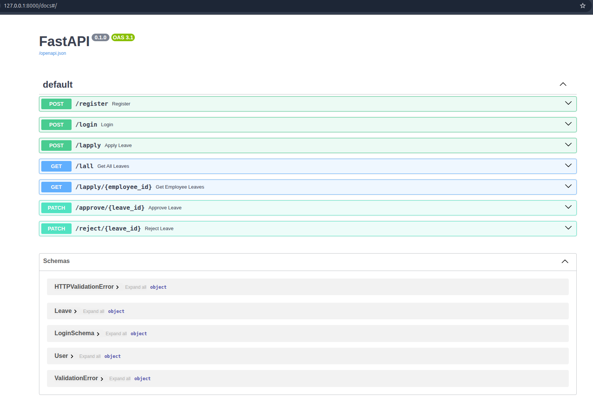

[Note: he application logic is fully verified and functional in the local development environment. There is a known configuration sync issue with the Vercel/Render production routing that is being patched.]

## Given Problem Statement
Build a basic web application where employees can apply for leave and employers can approve or reject those requests.

## Proposed Solution
Any person who is first time, shall make use of registration page via 'register' option available and make sure to mention there particular role (Employee / Higher Employee).

Based on the allocated role, the page gets redirected to required endpoint.
that is, 
- if the person is an employee, he would be directed to leave application page where they can apply for leave and also check out if any leave approvals are 'pending'.
- if the person is an employer, he would be directed to leave management page where they would require to approve or reject the 'pending' leaves applied via various employees.

## Tech Stacks
Frontend - Vue and Basic CSS
Backend - Python (FastAPI)
Database - MongoDB

## Photos for reference

### System Diagram

### Login Page

### Register Page

### Frontend View

### Employee Dashboard

### Employer Dashboard

### Backend Architecture

